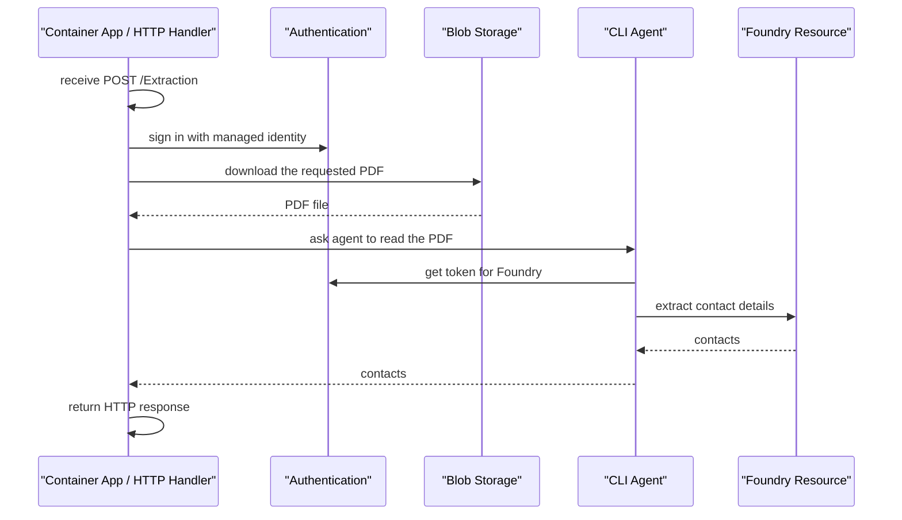

# Extraction flow sequence

This diagram shows the simple extraction flow. The container app hosts the HTTP handler, so they are shown as one component.

```mermaid
sequenceDiagram
    participant Api as "Container App / HTTP Handler"
    participant Auth as "Authentication"
    participant Blob as "Blob Storage"
    participant Agent as "CLI Agent"
    participant Foundry as "Foundry Resource"

    Api->>Api: receive POST /Extraction
    Api->>Auth: sign in with managed identity
    Api->>Blob: download the requested PDF
    Blob-->>Api: PDF file
    Api->>Agent: ask agent to read the PDF
    Agent->>Auth: get token for Foundry
    Agent->>Foundry: extract contact details
    Foundry-->>Agent: contacts
    Agent-->>Api: contacts
    Api->>Api: return HTTP response
```
